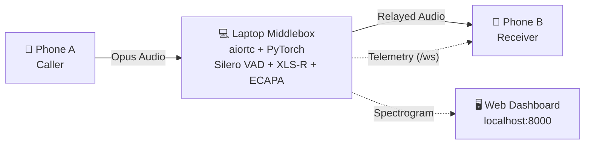
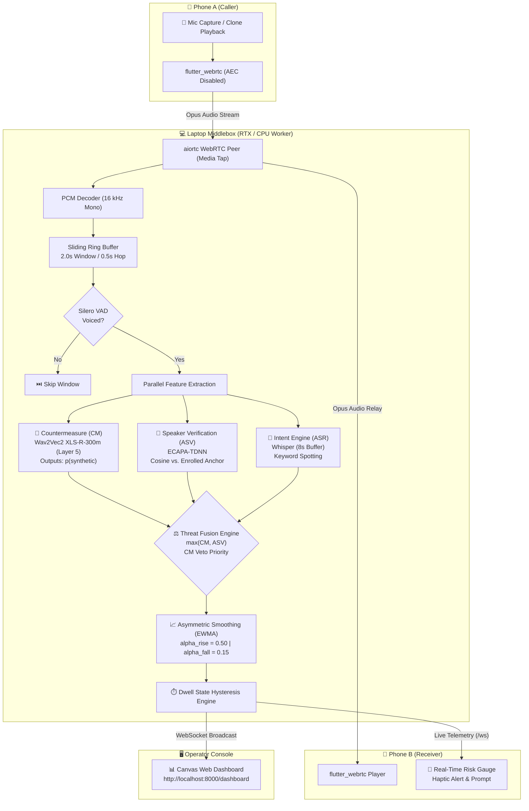
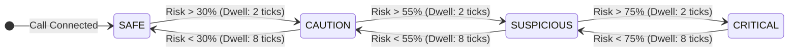
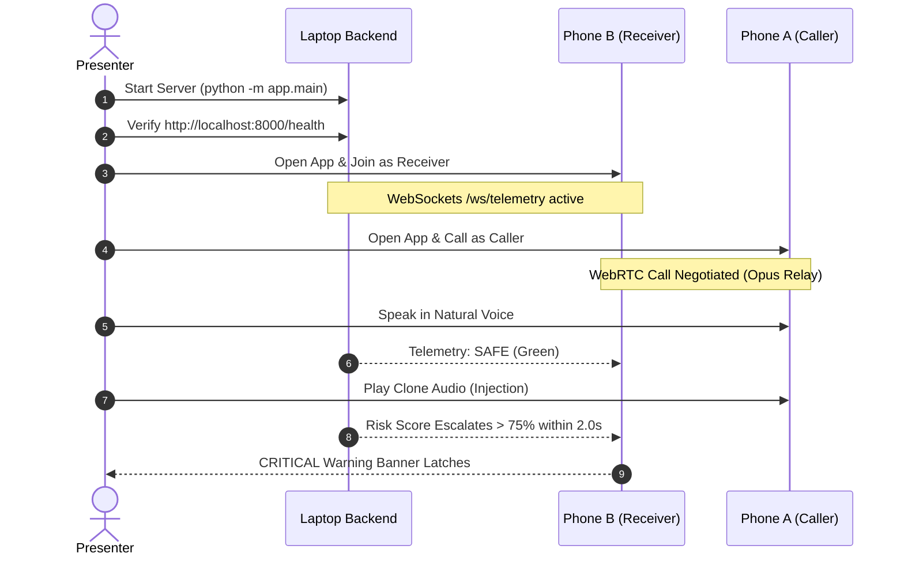

# 🛡️ DefVoice — SIH26104

> **Real-time forensic detection of voice-cloning impersonation on live VoIP calls, operating entirely on a local laptop middlebox over Wi-Fi.**

<p align="center">
  
  
  
  
  
  
</p>

---

## 📌 Executive Summary

Phone A calls Phone B through an on-premises laptop acting as an in-path WebRTC media peer. The laptop decodes the relayed Opus audio stream, evaluates each sliding 2-second audio window for synthetic speech artefacts and biometric speaker mismatch, and streams real-time threat telemetry back to Phone B every 500 ms.



---

## 🎯 What This Does — And What It Does Not

- **What it does:** Detects cloned and AI-synthesized speech on calls placed inside this application, where the middlebox directly controls and brokers both ends of the media path.
- **What it does not do:** It does not intercept native cellular (GSM/VoLTE), PSTN, WhatsApp, or standard Android dialers. Unrooted Android exposes zero APIs permitting third-party apps to intercept two-way call audio. The in-app VoIP call is the honest, reproducible demonstration of how a carrier deploys this technology at the IMS / SBC (Session Border Controller) layer, where telecom infrastructure already processes the media.
- **Generalization reality:** This is not a universal detector. It detects the attacks and vocoders it was calibrated on over the measured audio channel. Expect a higher equal error rate (EER) against completely unseen zero-shot TTS engines; production hardening requires periodic acoustic retraining.

---

## 🏗️ System Architecture & Media Flow



> **Fusion Policy:** Scoring is calculated as `max(CM, ASV)`, not a weighted average. A sophisticated clone is deliberately engineered to maximize acoustic similarity to the enrolled victim. High speaker similarity paired with synthetic vocoder artifacts indicates a targeted impersonation attack — that condition triggers an escalated threat penalty rather than an authenticity discount.

---

## 🚦 Threat State Transition Logic

The decision engine applies asymmetric dwell hysteresis to eliminate UI needle jitter during natural conversational pauses:



---

## 📱 Mobile App (Download & Setup)

### Option A: Pre-Built Release APK (Quickest)

- Download the compiled production binary: [app-release.apk](https://github.com/Gagan-G-044/defvoice/releases/download/v1.0.0/app-release.apk) (~82.9 MB).
- Compatible with Android 6.0+ (API level 23+).
- Sideload onto two physical Android devices using USB transfer or ADB:

```bash
adb install -r app-release.apk
```

### Option B: Build From Source

```bash
cd mobile
flutter pub get
flutter build apk --release
# Output: mobile/build/app/outputs/flutter-apk/app-release.apk
```

---

## ⚙️ Handset Runtime Configuration

Open the app on both handsets and configure the connection parameters:

| Input Field | Purpose | Recommended Value |
|---|---|---|
| Server Address | Host laptop's Wi-Fi IP address | `192.168.x.x` (or `10.0.2.2` if Android Emulator) |
| Port | Backend listening port | `8000` |
| Session ID | Shared room identifier for both callers | `call_001` |
| Security Token | Auth token matching `DEFVOICE_TOKEN` | `demo-secret-token-123` |

> **Setup Order:** Tap **Check Backend** on both phones before placing calls. Always open Phone B (Receiver) first so the WebSocket telemetry channel is initialized before Phone A (Caller) dials.

---

## 🚀 Execution & Run Order



### 1. Backend Middlebox Setup

```bash
cd backend
python -m venv .venv

# Windows:
.venv\Scripts\activate
# Linux/macOS:
source .venv/bin/activate

pip install -r requirements.txt

# Run the test suite before launching
python -m pytest tests/ -v
```

Copy the environment template and start the service:

```bash
cp ../.env.example .env
set DEFVOICE_TOKEN=demo-secret-token-123
python -m app.main
```

- Interactive OpenAPI specs: `http://localhost:8000/docs`
- Raw health probe: `http://localhost:8000/health` (inspect engine status: `"cm_backend": "torch"`, `"degraded": false`)

### 2. Live Monitoring Web Dashboard

Open `http://localhost:8000/dashboard` in a browser on the laptop:

- Zero build steps, zero external CDN dependencies (runs completely offline on isolated presentation routers).
- Renders real-time audio waveforms, raw `p(synthetic)` probability ticks, and the hysteresis-smoothed risk meter.

### 3. Model Pipeline & Biometric Enrollment

```bash
# 1. Telephony & Codec Augmentation
python ml/codec_augment.py data/raw/ data/aug/ --codecs opus,g711

# 2. Extract and Cache XLS-R-300m Layer-5 Features
python ml/cache_features.py manifest.tsv data/feat/ --layer 5

# 3. Train Attentive Statistics Pooling Head
python ml/train_cm_head.py data/feat/ --out cm_head.pt
copy cm_head.pt backend\models\cm_head.pt

# 4. Enroll Target Biometric Speaker Voice Anchor
cd backend
python tools/enroll.py take1.wav take2.wav take3.wav --label cfo_priya
copy models\anchor_cfo_priya.npy models\anchor_exec.npy
```

### 4. Mandatory Pre-Flight Calibration

```bash
# Rule out inverted model polarity (Class 0 must be Bonafide, Class 1 Spoof)
python tools/check_cm_polarity.py --genuine real.wav --spoof clone.wav

# Confirm laptop inference speed is well under 500ms
python tools/bench_latency.py

# Calibrate ASV acceptance thresholds for hall acoustics
python tools/calibrate_asv.py --same heldout_same/ --other other_people/
```

---

## 🎬 Live Demonstration Protocol

1. **Environmental Setup** — Laptop and both phones connected to the same Wi-Fi router. Laptop plugged into wall power with `http://localhost:8000/dashboard` projected on screen.
2. **Duplex Pairing** — Phone B enters Receiver mode. Phone A enters Caller mode and initiates the call.
3. **Legitimate Control Test** — Speak naturally into Phone A using high-urgency financial phrases ("Transfer 8 lakhs to vendor account immediately").
   - *Observed Result:* Risk gauge remains steady in **SAFE** (Green). Proves semantic urgency alone does not trigger false positives.
4. **Adversarial Injection Test** — Trigger a clone audio sample on Phone A (`mobile/assets/clones/cfo_wire_8lakh_hi.wav`).
   - *Observed Result:* Within 2 seconds, Phone B escalates through **CAUTION** to **CRITICAL** (Red), triggers a haptic vibration warning, and displays the out-of-band verification modal.
5. **Dashboard Forensic Walkthrough** — Show judges the dashboard comparison: the thin grey trace (raw per-window probability) versus the thick indigo line (smoothed hysteresis).

---

## 🔧 Operational Troubleshooting

| Symptom | Root Cause | Exact Resolution |
|---|---|---|
| Phone cannot reach laptop | Access Point (AP) isolation active on venue Wi-Fi router. | Reverse ports via USB cable: `adb reverse tcp:8000 tcp:8000`, then set Phone host IP to `127.0.0.1`. |
| Risk needle never moves | Backend is operating in stub mode due to missing model weights. | Check `GET /health`. If `"degraded": true`, place `cm_head.pt` into `backend/models/`. |
| Attack clip produces silence on Phone B | Hardware Acoustic Echo Cancellation (AEC) enabled on Phone A. | Phone A requests `rawCapture: true`. If ignored by device, hold an external speaker to the mic or run `attacker_cli.py`. |
| Call connects, but no audio | Stale WebRTC session on the laptop media peer. | Terminate `python -m app.main`, restart the process, and place the call again. |
| Telemetry updates > 2s late | Single-frame inference latency exceeds window hop. | Run `python tools/bench_latency.py`. If p95 > 0.5s, set `HOP_SEC = 1.0` in `backend/app/core/config.py`. |

---

## 📂 Repository Layout

```
defvoice/
├── backend/
│   ├── app/
│   │   ├── core/         # config.py (tuning thresholds), ring_buffer.py
│   │   ├── engine/       # Silero VAD, XLS-R CM, ECAPA ASV, fusion engine, pipeline
│   │   ├── rtc/          # middlebox.py (aiortc media peer and audio tap)
│   │   └── main.py       # FastAPI application, WebSockets, static dashboard
│   ├── models/           # Local weight storage (.gitkeep, weights git-ignored)
│   ├── tests/            # 31 unit & regression tests (telemetry, hysteresis, VAD)
│   └── tools/            # Calibration, enrollment, and latency benchmark utilities
├── dashboard/            # index.html (Pure JS/HTML5 Canvas live telemetry dashboard)
├── ml/                   # Codec augmentation, feature caching, and head training scripts
└── mobile/
    ├── lib/
    │   ├── screens/      # HomeScreen (config), DialerScreen (call & telemetry gauge)
    │   ├── services/     # WebRTC media routing, WebSocket telemetry client
    │   └── config.dart   # Sanitized dynamic host environment settings
    └── assets/clones/    # Evaluation voice clone audio fixtures
```

---

## ✅ Verification Metrics

- **Backend unit & regression suite:** 31 / 31 passed (100%) via `pytest backend/tests/`.
- **Mobile static analysis:** 0 warnings, 0 errors via `flutter analyze lib/`.
- **Binary artifact:** Production release APK compiled successfully (`app-release.apk`, 82.9 MB).
- **Sanitization audit:** Zero occurrences of private LAN IPs (`192.168.*`), hardcoded development drive paths (`D:\*`, `C:\Users\*`), or leaked secrets in Git tracking.

---

## ⚖️ Research Ethics & Boundary Conditions

Voice cloning technology presents substantial dual-use risks. All voice samples, anchors, and cloning targets utilized in this project were recorded and generated exclusively with explicit, documented consent from participating project team members. Impersonating public figures or utilizing unverified biometric identities is strictly prohibited across all pipelines and documentation. Synthetic attack audio is quarantined strictly within evaluation sets and excluded from detector training splits.
